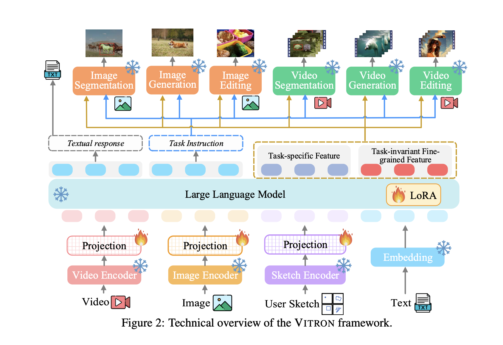

## VITRON: A Unified Pixel-level Vision LLM for Understanding, Generating, Segmenting, Editing

[Code](https://vitron-llm.github.io/) | [Paper](https://haofei.vip/downloads/papers/Skywork_Vitron_2024.pdf)

### Summary:

Vitron tries to address two common gaps with MLLMs (multimodal LLMs):
1. MLLMs are generalist e.g., they have coarse-grain instance-level understanding.
2. Lack of unified support for both images and videos and their coverage for visual understanding and generation.

### Architecture:

VITRON employs a common 'encoder-LLM-decoder' architecture, similar to other popular MLLMs. The framework consists of three main components:

1. **Frontend Vision & Language Encoders**: These encoders process the input images and text.
2. **Central LLM**: This component is responsible for semantic understanding and text generation.
3. **Backend Decoder Modules**: These modules handle user responses and vision manipulation.

    

### Details

### Image and Video Encoder:

For both images and videos, we use the CLIP ViT-L/14@336px model as the encoder. The video encoder processes each frame independently and applies average pooling across the temporal dimension to generate overall temporal representation features.

### Core LLM:

In VITRON, the LLM is Vicuna (7B, version 1.5) to process inputs from both language and visual modalities for semantic understanding and reasoning. The LLM outputs textual responses for visual comprehension tasks and transmits instructions to backend modules for complex tasks like visual segmentation, generation, and editing. VITRON integrate discrete textual instructions and continuous signal embeddings to enhance task performance. The LLM outputs: 
1. Text responses for users.
2. Text instructions for module invocation.
3. Feature embeddings of special tokens, split into task-specific and task-invariant visual-language features.

#### BackEnd Models

To enable our MLLM with various visual task abilities, we integrate an array of singleton vision
specialists into LLM. For image generation and editing, we integrate the diffusion-based model
GLIGEN [57]. For image and video segmentation, we opt for SEEM [139]. For video generation,
ZeroScope [8] and I2VGen-XL [131] are utilized for text-to-video and image-to-video tasks, respectively. Lastly, for video editing functionality, we incorporate StableVideo [9]. The text instructions
from LLM first determine which task module to invoke; simultaneously, feature embeddings are fed
5
into the corresponding module’s feature encoder to assist with task execution. Specifically, we design
a structured invocation template, including 1) Module name, 2) Invocation command, and 3) Region
(optional) specifying a fine-grained vision feature needed for certain tasks. The feature embeddings
include both task-specific features and task-invariant fine-grained features. The purpose of this design
is to achieve feature decoupling, during which we aim to have the task-invariant fine-grained features
shared as widely as possible among all tasks to facilitate synergy between different tasks.

