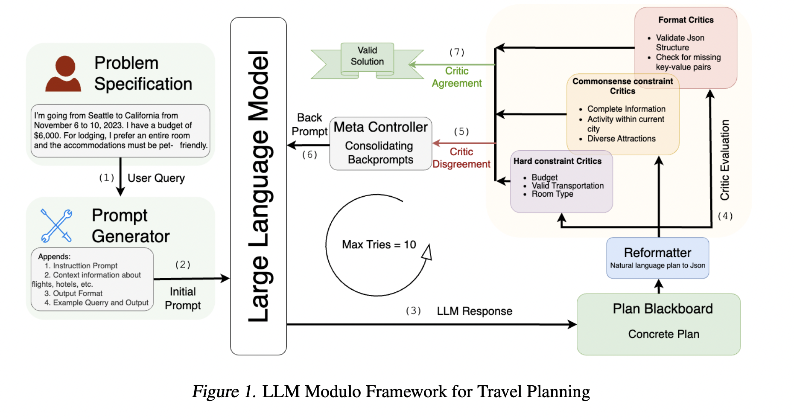

## Can LLMs Plan and Reason?

Most of the ideas below are excellent Subbarao Kambhampati talk at ACL from [Video](https://www.youtube.com/watch?v=0E9BbA0gO1A&t=3087s)

### Key Concepts

1. **Ergodic vs. Non-Ergodic Environments**:
   - **Ergodic Environment**: Transitioning between states is possible with a non-zero probability, meaning there's no risk of being permanently stuck in any one state.
   - **Non-Ergodic Environment**: Planning becomes crucial as errors can lead to high costs or irrecoverable states. Incorrect plans can be very costly.

2. **Plan Robustness**:
   - Defined as the likelihood that a plan will accomplish its goal.
   - In deterministic settings, robustness equates to correctness.
   - To measure robustness, simulators or world models are necessary, but it's unclear how much real-world modeling LLMs can handle.

3. **Plan Quality**:
   - Quality encompasses user preferences and style (e.g., travel plans involving walking, biking, or driving).
   - LLMs are good at capturing style preferences, as style is a property of the data distributions they learn from.
   - Correctness is instance level propoerty. LLMs cannot guantentee it.

4. **LLMs and Decision-Making**:
   - LLMs are trained on next-token prediction, learning statistical distributions over deterministic rules.
   - This makes them adept at stylistic adaptation but unable to ensure correctness, which depends on instance-level properties.
   - Since LLMs address undecidable questions, they operate on fixed time per token, treating both solvable and unsolvable problems alike, without guarantees.

5. **Limits of LLMs**:
   - They cannot guarantee robustness or correctness.
   - They excel in generating ideas and translating problems but aren’t ideal for deterministic or non-deterministic problem solving that requires guarantees.

6. **Practical Use**:
   - LLMs are excellent idea generators, leveraging vast knowledge and adaptability.
   - While not suited for deterministic planning, they’re valuable for idea generations given the ideas be verified by external validator (like python interpreter).

## Robust Planning with LLM-Modulo Framework: Case Study in Travel Planning  [Paper](https://arxiv.org/pdf/2405.20625)

#### Summary:

Despite advanced agentic methods like CoTs and React LLMs perform poorly on the long term planning tasks like travel planning.

    

