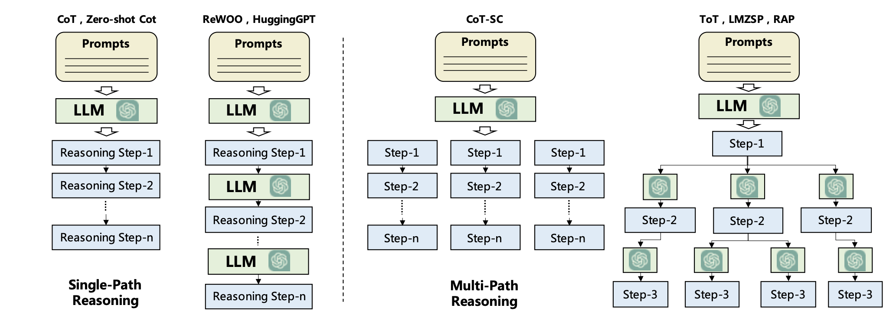

## Agents

Below is summary with some thoughts/addition on the excellent review paper **A Survey on Large Language Model based Autonomous
Agents** [Paper](https://arxiv.org/pdf/2308.11432)

### Autonomous Agent

> "An autonomous agent is a system situated within and a part of an environment that senses that environment and acts on it, over time, in pursuit of its own agenda and so as to effect what it senses in the future."
> 
> — Franklin and Graesser (1997)

### Reinforcement Learning Vs LLM agents:

### 1. Learning Paradigms
   - **Reinforcement Learning (RL)**: RL involves learning through direct interaction and feedback from the environment. Agents adjust their strategies based on rewards or penalties, optimizing their actions over time to maximize cumulative rewards. This approach is inherently suited for tasks requiring exploration, adaptation, and continuous improvement within dynamic environments.
   - **Large Language Models (LLMs)**: LLMs are trained on vast datasets through supervised learning, focusing on predicting the next word in a sequence. They don’t interact with live environments but instead derive insights from large text corpora. This enables them to generate coherent and contextually relevant language, but their static training may limit adaptability in scenarios requiring real-time learning.

### 2. Decision-Making Frameworks
   - **RL Agents**: These agents make sequential decisions within a Markov Decision Process (MDP) framework, where each action affects the future state and rewards. This structured approach allows RL agents to optimize strategies for long-term benefits and handle complex dependencies over time.
   - **LLMs**: LLMs lack a structured decision-making framework. They generate outputs based on probability distributions rather than explicit planning mechanisms, which can lead to significant limitations in scenarios requiring accurate and reliable planning. As a result, LLM-generated plans can sometimes be incomplete or outright incorrect, especially for complex, multi-step tasks.

### 3. Knowledge and Domain Adaptability
   - **World Knowledge**: LLM-based agents possess extensive internalized knowledge, enabling them to generalize across diverse topics without domain-specific training. This makes them highly versatile for generating information or simulating general knowledge across many fields.
   - **Domain-Specific Learning in RL**: RL agents typically excel in specialized tasks where they can interact with the environment. However, they may struggle with generalization across different domains without targeted retraining, as they rely heavily on specific reward structures and experiences from their training environments.

### 4. Reliability and Planning Accuracy
   - **LLMs**:  LLMs are powerful for generating ideas and simulating dialogue, they may lack reliability in decision-making and planning. Their plans can sometimes be entirely wrong or implausible due to their reliance on statistical associations rather than factual correctness. Without an inherent model of the environment or ability to verify actions, LLMs may produce errors, particularly for complex or sequential tasks.
   - **RL Agents**: RL agents are generally more reliable in planning for specific tasks within familiar environments, as they can iteratively refine their strategies based on feedback. However, they may lack flexibility for tasks outside their trained domains, limiting their use in general-purpose planning.

We will focus mostly on LLM agents RL agents will follow its seperate series of posts. A significant distinction between traditional LLMs
and the agents is that the latter must possess the capability to learn and complete tasks in dynamic environments

### Construction of LLM agents
In order to construct the LLM agensts, there are two significant aspects, that is,
1. Which architecture should be designed to better
use LLMs
2. Give the designed architecture,
how to enable the agent to acquire capabilities for
accomplishing specific tasks.

When comparing LLM-based autonomous
agents to traditional machine learning, designing
the agent architecture is analogous to determining
the network structure, while the agent capability
acquisition is similar to learning the network parameters.

#### Agent Architectures

We need to provide LLMs with different "modules" to enance their capabilities and act like an agent in an environment below provides 

**Profiling Module:**

The profiling module aims
to indicate the profiles of the agent roles, which
are usually written into the prompt to influence the
LLM behaviors. Agent profiles typically encompass basic information such as age, gender, and
career as well as psychology information, reflecting the personalities of the agent, and social
information, detailing the relationships between
agents. The choice of information to profile the
agent is largely determined by the specific application scenarios.
The best practice for now is to get the profile information from real world dataset like age, gender, personal traits and movie preferences, if it is not available make some handcrafted profiles and use them as few shot examples and then use LLMs for creating any new agent profiles that might be needed

**Memory Module:**

Memory module stores information perceived from the environment and leverages
the recorded memories to facilitate future actions.
The memory module can help the agent to accumulate experiences, self-evolve, and behave in a more
consistent, reasonable, and effective manner. Two commonly used memories are 

1. Short Term Memory

2. Long Term Memory

**Unified Memory**

This structure only simulates the human shot-term memory, which is usually
realized by in-context learning, and the memory information is directly written into the prompts e.g CALYPSO is an agent designed for the game Dungeons & Dragons, which
can assist Dungeon Masters in the creation and narration of stories. Its short-term memory is built
upon scene descriptions, monster information, and
previous summaries. The drawback of short term memory is limitation of context window
of LLMs, it’s hard to put all memories into prompt,
which may degrade the performance of agents.This
method has high requirements on the window length
of LLMs and the ability to handle long contexts.

**Hybrid Memory**

Hybrid Memory explicitly models the "maybe" human short-term and long-term memories. The short-term memory temporarily buffers recent perceptions, while long-term memory consolidates important information over time. e.g AgentSims  implements a hybrid memory architecture. The information provided in the prompt can be considered as short-term
In order to enhance the storage capacity of memory, the authors propose a long-term
memory system that utilizes a vector database, facilitating efficient storage and retrieval. Specifically, the agent’s daily memories are encoded as
embeddings and stored in the vector database. If
the agent needs to recall its previous memories, the
long-term memory system retrieves relevant information using embedding similarities. This process
can improve the consistency of the agent’s behavior. 

**Memory Formats**

1. Natural Language

   Firstly, the memory information can be expressed
   in a flexible and understandable manner. Moreover,
   it retains rich semantic information that can provide
   comprehensive signals to guide agent behaviors. In
   the previous work, Reflexion [12] stores experiential feedback in natural language within a sliding
   window.

2. Embeddings

   Memory data is stored in embeddings vectors, e.g ChatDev
   encodes dialogue history into vectors for retrieval.

3. Database

   In this format, memory information is stored in databases, allowing the agent
   to manipulate memories efficiently and comprehensively. For example, ChatDB [40] uses a database as
   a symbolic memory module. The agent can utilize
   SQL statements to precisely add, delete, and revise the memory information. In DB-GPT [41], the
   memory module is constructed based on a database.
   To more intuitively operate the memory information, the agents are fine-tuned to understand and
   execute SQL queries, enabling them to interact with
   databases using natural language directly.

4. Stuctured List

   In this format, memory information is organized into lists, and the semantic of
   memory can be conveyed in an efficient and concise
   manner. For instance, GITM stores action lists
   for sub-goals in a hierarchical tree structure
   It utilizes a key-value list structure. In this structure, the keys are represented by
   embedding vectors, while the values consist of raw
   natural languages.

### Memory Operations
   1. Memory Reading :

      The objective of memory reading is to extract meaningful information
      from memory to enhance the agent’s actions.  For
      example, using the previously successful actions
      to achieve similar goals. The following equation from existing literature for
      memory information extraction can be derived

      $$
      m^* = \arg \min_{m \in M} \left( \alpha s_{\text{rec}}(q, m) + \beta s_{\text{rel}}(q, m) + \gamma s_{\text{imp}}(m) \right)
      $$

      M is the set of all memories.
      s
      rec(·), s
      rel(·) and s
      imp(·) are the scoring functions for
      measuring the recency, relevance, and importance. By changign the weights for these scoring metrics we can change
      how memory is read. These scoring functions can be implemented using different methods for example rel(q, m)
      by FAISS (Facebook AI Similarity Search)) and so on.

   2. Memory Writing:

      The purpose of memory writing is to store information about the perceived
      environment in memory. Two important factors to take into consideration.
      1. How to store relavant/related memories (Memory Duplicated)
         
         One proposed method for it is to he successful action sequences related to the same subgoal are stored in a list. Once the size of the list
         reaches N(=5), all the sequences in it are condensed
         into a unified plan solution using LLMs. The original sequences in the memory are replaced with the
         newly generated one
      2. How to remove information from memory when limit is reached. (Memory Overflow)

         We can use FIFO when memory has reached limits or let user decide which memory to remove.

   3. Memory Reflection

      This module gives the agent capability to
      summarize its past experiences stored in memory
      into broader and more abstract insights.  e.g In GITM, the actions that successfully accomplish the sub-goals are stored in a list. When the
      list contains more than five elements, the agent summarizes them into a common and abstract pattern
      and replaces all the elements. 

### Planning Module

   Memory module as responsible for managing the agents’ past behaviors,
then planning module assist the agents in planning their future
actions. Planning module essentially divides the complex task in steps and solve these steps.
**An important insight is LLM might not be planning as in formal planning and cannot generate guarantees like formal solver but most 
of the tasks can be planned with reasonable solution by dividing them and just learning from internet scale large data.**
We can divide the planning module into 

1. Planning without feedback:

   Single Path Planning:

   In this approach, agents execute actions without receiving feedback to influence future behaviors. Instead, they follow a predetermined sequence of steps to complete a task.
   One example of this is Chain of Thought (CoT), where the task is decomposed into intermediate steps that cascade into one another. CoT prompts include reasoning steps as examples, guiding the LLM to plan and act step-by-step.
   Zero-shot-CoT enables LLMs
   to generate task reasoning processes by prompting them with trigger sentences like "think step by
   step". HuggingGPT first decomposes the task into
   many sub-goals, and then solves each of them based
   on Huggingface. Different from CoT and Zero-shotCoT, which outcome all the reasoning steps in a
   one-shot manner, HuggingGPT produce the results by accessing LLMs multiply times.

   Multi Path Planning:

   In this strategy, the
reasoning steps for generating the final plans are
organized into a tree-like structure. Each intermediate step may have multiple subsequent steps. This
approach is analogous to human thinking, as individuals may have multiple choices at each reasoning
step. e.g. Tree of Thoughts (ToT) 
is designed to generate plans using a tree-like reasoning structure. In this approach, each node in
the tree represents a "thought," which corresponds
to an intermediate reasoning step. The selection
of these intermediate steps is based on the evaluation of LLMs. The final plan is generated using
either the breadth-first search (BFS) or depth-first
search (DFS) strategy. 

    

   **External Planners**:

   Despite LLMs ability to peform zero-shot planning, effectively for some tasks they dont guarantee optimal or even correct plan for specific plans. To address this challenge, researchers turn to external planners. These tools are well-developed and employ efficient search algorithms to rapidly identify correct, or even optimal plans. e.g , LLM+P  first transforms
   the task descriptions into formal Planning Domain
   Definition Languages (PDDL), and then it uses an
   external planner to deal with the PDDL. Finally, the
   generated results are transformed back into natural
   language by LLMs.

2.  Planning with Feedback:

Planning complex dynamic tasks without feedback
can be less effective due to the following reasons:

1.  Generating a flawless plan directly from the
beginning is extremely difficult as it needs to consider various complex preconditions. As a result,
simply following the initial plan often leads to failure. Moreover, the execution of the plan may be
hindered by unpredictable transition dynamics, rendering the initial plan non-executable. Humans also tackle complex
tasks, we find that individuals may iteratively make
and revise their plans based on external feedback. The feedback can be obtained from environments, humans (although as famously mentioned by S.K life is too short to be feedback/verifier for LLMs),
and models.

      **Env Feedback:**

       This is the feedback from the real world or simulation. For instance, it could be the game’s task
         completion signals or the observations made after
         the agent takes an action. In specific, ReAct
         proposes constructing prompts using thought-actobservation triplets. The thought component aims
         to facilitate high-level reasoning and planning for
         guiding agent behaviors. The act represents a specific action taken by the agent. The observation
         corresponds to the outcome of the action, acquired
         through external feedback, such as search engine
         results.

      **Human Feedback:**

      In addition to obtaining
      feedback from the environment, directly interacting with humans is also a very intuitive strategy to
      enhance the agent planning capability e.g  Inner Monologue
      collects both environment and human feedback to
      facilitate the agent plans.

      **Model Feedback:**

      Apart from the aforementioned environmental and human feedback, which
      are external signals, people have also investigated the utilization of internal feedback from the
      agents themselves. e.g Reflexion is developed
      to enhance the agent’s planning capability through
      detailed verbal feedback. In this model, the agent
      first produces an action based on its memory, and
      then, the evaluator generates feedback by taking
      the agent trajectory as input. In contrast to previous studies, where the feedback is given as a scalar
      value, this model leverages LLMs to provide more
      detailed verbal feedback, which can provide more
      comprehensive supports for the agent plans.

   

