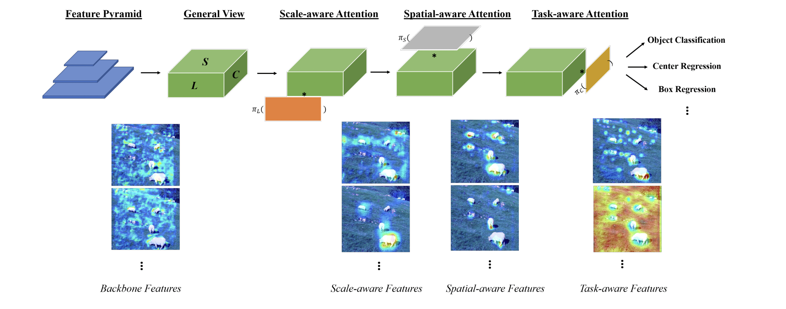

## Object Detection

Dynamic Head: Unifying Object Detection Heads with Attentions  [Paper](https://arxiv.org/pdf/2106.08322)
 
 ### Summary 

It coherently combining multiple self-attention mechanisms between feature levels for scaleawareness, among spatial locations for spatial-awareness, and within output channels for task-awareness, the proposed approach significantly improves the representation ability of object detection heads without any computational
overhead. 
Consider output of a backbone network,ca 3-dimensional tensor with dimensions: level, space, and channel. ONe solution proposed is to implement a full self-attention mechanism over this tensor which will be very computational expensive main idea is to have sperate self-attention for each dimension.

### Architecture

    

