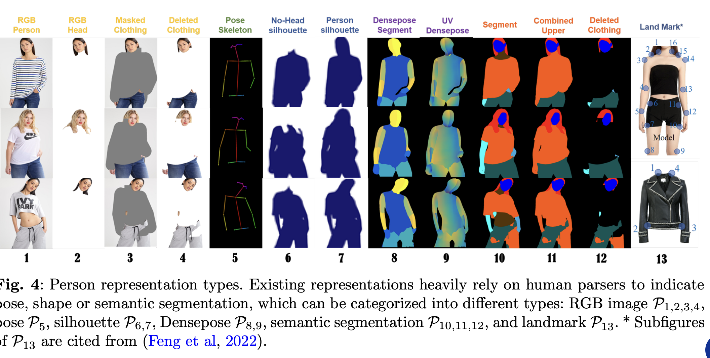
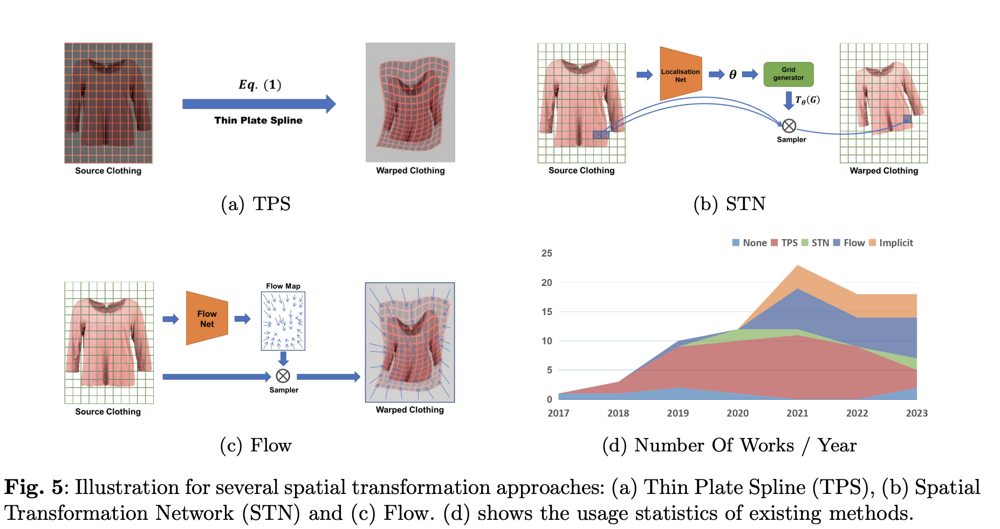
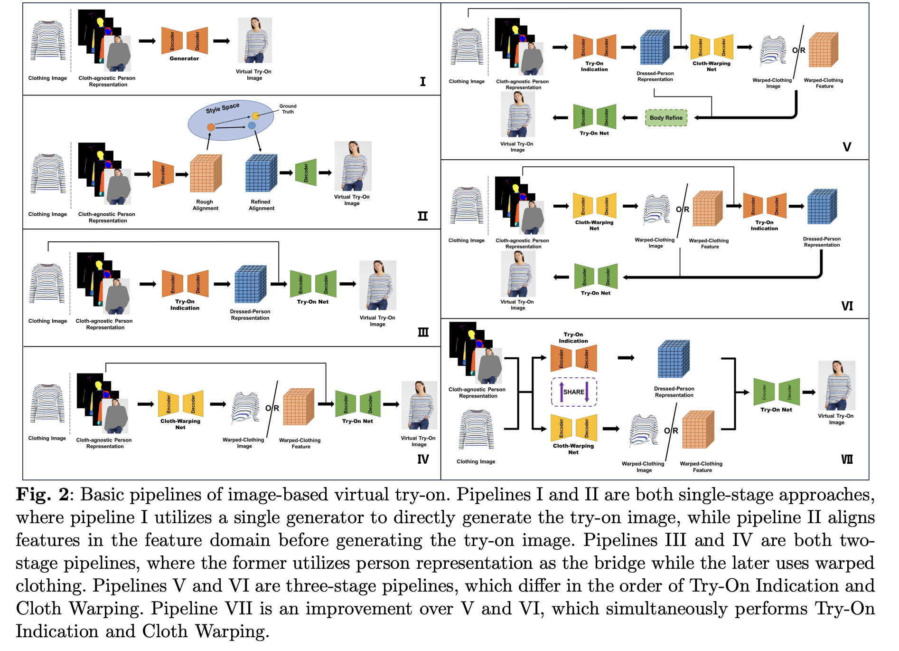

# 2D Virtual Try On.
A good summary [Paper](https://arxiv.org/pdf/2311.04811) on this topic this article exands and give more detail examples.

Image-based virtual try-on can be regarded as a conditional image generation task that uses in-shop clothing image `Ic` and person image `Ip` as raw data. The raw data is pre-processed as conditioned information to guide the model for generating try-on images `Itry−on = G(Ip, Ic)`. Three key modules are usually involved in image-based virtual try-on:

1. **Try-On Indication**: . 
    
    This module’s primary function is to create a "prior", about how the clothing should be warped and fused onto the person’s body in the virtual try-on process. 

    Input data to this module can be a combination of below
    
    - **Semantic information:** (like arms, torso, legs) in a segmented form.

    - **DensePose:** Provides a more precise, dense mapping of a 3D body to a 2D image. This allows for better alignment and positioning of clothing.

    - **OpenPose:** Tracks skeletal and pose key points (like joints) of the person, which helps in determining the orientation and posture.


    Output this module predicts the spatial structure of person body under the try-on state

2. **Cloth Warping**:

    It transforms the clothing image
to the spatial distribution under the try-on
state. The inputs of this module are clothing images and person body features such as
cloth-agnostic person representation or dressed
person representation obtained in the module
of Try-On Indication, and by using warping methods
such as FlowNet the output of this module could be warped
clothing images or deformed clothing features.


3. **Try-On Module**: This modules generates  final try-on
image by fusing the person body and clothing
features. Interpolation or generative networks
are designed for this module, and the output
Ideally the generated try on image should meet the following requirements (not in order or importance):

    - The clothing within the try-on area should
    be clear and natural.
    - The content outside the try-on area (excluding the original clothing that is planned to take off) should remain unchanged.
    - There should be a correct semantic relationship between the new clothing and the person body.


### Cloth-agnostic Person Representation

It is difficult to acquire the
triplet (person image `Is`, in-shop clothing image
`Ct`, try-on image `It`) for training. Instead, pairs
of person image and in-shop clothing image are
commonly seen. Therefore, cloth-agnostic person
representation is studied to remove the clothing that is planned to take off, and constitute
the triplet (cloth-agnostic person representation
Ignostic `Iagn`, in-shop clothing image `Ct`, **person image**
`Is`) for supervised training.
This approach allows supervised training of virtual try-on systems by using pairs of person images and clothing images.
Cloth-agnostic person representations are used to preserve body features (like pose, shape, and semantics) while removing old clothing. These representations can be categorized into the following types:

-  RGB Image (P1, P2, P3, P4)

    - (P1): Original person image with existing clothing.
    - (P2): Image with only the head visible, parsed using human parsing techniques.
    - (P3): Masked image where try-on areas are covered in gray.
    - (P4): Deleted clothing areas, keeping only the background visible.
  
-  Pose Keypoints (P5)
    - Pose keypoints provide the positions of 18 body parts (like shoulders, hips, etc.). These keypoints are crucial for guiding the deformation of the new clothing to align with the person’s body.

- Silhouette (P6, P7)
    - Silhouettes offer the contour of the body, giving rough shape and pose information. This representation provides an outline of the person without showing details of the original clothing.

- DensePose (P8, P9)
    - (P8): Semantic parsing from DensePose, giving detailed 3D body shape.
    - (P9): UV mapping coordinates for aligning a 3D model with the body, offering a more accurate body shape under clothing.

- Semantic Segmentation (P10, P11, P12)
    - (P10): Provides segmentation with contours of the original clothing, but this can affect the try-on process.
    - (P11): Combines skin and clothing areas, eliminating the influence of the original clothing.
    - (P12): Completely removes the original clothing, keeping only unrelated semantic regions. However, this also removes some important body shape information.

- Landmarks (P13)

    - Landmark representations are used for shape alignment. They guide clothing deformation by ensuring that key points (e.g., shoulders, neck) on the clothing align with the corresponding body points.


   <p align="center">
    
</p>


Cloth-agnostic person representations, including RGB images, pose keypoints, silhouettes, DensePose, and semantic segmentation, enable the removal of original clothing and provide necessary body details for virtual try-on tasks. These representations ensure that the system can accurately deform and align new clothing with the body, which can lead to more realistic try-on results.

### Try On Indication

 The Try-On Indication module takes the cloth-agnostic person representation and the target clothing information to predict the dressed person’s appearance. It is a rough semantic map or low-quality image where the clothing is roughly aligned to the body, but it lacks detail, sharpness, and realism. It’s more of a guide that gives an idea of where the clothing should be placed. This module usually takes the form of encoder decoder module.
The Try-On Indication module and the
Clothing Warping module are closely related and
affect each other. HR-VTON
inputs clothing images, clothing Masks and person
representation P8,13 at the same time, and simultaneously generates warped clothes and person’s
semantic distribution. The warping path and the
semantic prediction path can keep communication
through the Fusion Block.

### Cloth Warping:
The Cloth Warping module in a virtual try-on system aims to transform the clothing's spatial distribution to match the person’s body. This is critical for ensuring that the clothing realistically aligns with the person’s pose and shape. Various transformation methods are used for this, including Thin Plate Spline (TPS), Spatial Transformation Network (STN), Flow Net, and Implicit Transformation. 

#### Thin Plate Spline (TPS):

 TPS simulates 2D deformations, using control points to map the original and target positions of the clothing. This method is widely used for warping clothing in virtual try-on systems.

 TPS uses a set of control points (such as grid nodes) and interpolates the transformation between these points to generate smooth deformations. However, a key challenge with TPS is the lack of ground truth for the target positions in virtual try-on tasks, making it difficult to estimate precise transformations


```python

from scipy.interpolate import Rbf

# Control points: chosen manually or derived from a method like shape context matching
source_points = np.array([[100, 100], [200, 100], [150, 200], [120, 300]])  # Source points (on the clothing)
target_points = np.array([[110, 120], [210, 130], [160, 210], [130, 320]])  # Target points (on the person)

# Thin Plate Spline (TPS) warping using Radial Basis Functions (RBF)
def tps_warp(source_points, target_points, img):
    grid_x, grid_y = np.meshgrid(np.arange(img.shape[1]), np.arange(img.shape[0]))

    # Apply Radial Basis Function interpolation for x and y
    rbf_x = Rbf(source_points[:, 0], source_points[:, 1], target_points[:, 0], function='thin_plate')
    rbf_y = Rbf(source_points[:, 0], source_points[:, 1], target_points[:, 1], function='thin_plate')

    # Warp grid based on RBF interpolations
    warped_x = rbf_x(grid_x, grid_y)
    warped_y = rbf_y(grid_x, grid_y)

    # Map the original image to the new warped grid
    warped_image = cv2.remap(img, warped_x.astype(np.float32), warped_y.astype(np.float32), interpolation=cv2.INTER_LINEAR)
    
    return warped_image
```

#### Spatial Transformation Network (STN):

 STNs are often used in conjunction with TPS to better control the warping process. STNs help constrain the transformation and prevent excessive or unrealistic deformations. STNs can work in an unsupervised or weakly supervised manner, even without direct ground truth (GT) for every transformation. Below are some examples of self supervised/weak supervision learning using STN

  - Rather than needing explicit ground truth for transformations (e.g., how exactly the clothing should be warped), STNs learn the transformation by minimizing a task-specific loss function. e.g  In virtual try-on, you could define a task where the STN warps the input clothing image to fit a specific body shape. You don't need explicit ground truth transformations but can instead train the STN by minimizing the difference between the generated try-on image and the real-world try-on image (or some other supervision signal like perceptual loss).
  
  - **Weak Supervision:** In many real-world scenarios, STNs are trained with weak supervision where explicit ground truth transformations are unavailable, but other supervision signals are available. These might include:

    - **Pose Keypoints:** We can provide keypoints that indicate the person's body pose. The network learns how to warp the clothing image to align with these keypoints.

    - **Segmentation Masks:** We can supervise the network to align the clothing with specific semantic regions (e.g., matching a clothing region to the torso region).
    In these cases, the STN learns the transformation by minimizing a matching loss or segmentation loss. This allows the model to transform images in a weakly supervised manner without needing explicit transformation ground truth.

```python
# Spatial Transformer Network (STN) 
class STN(nn.Module):
    def __init__(self):
        super(STN, self).__init__()
        # Localization network (can be a simple CNN or other architecture)
        self.localization = nn.Sequential(
            nn.Conv2d(3, 8, kernel_size=7),
            nn.MaxPool2d(2, stride=2),
            nn.ReLU(True),
            nn.Conv2d(8, 10, kernel_size=5),
            nn.MaxPool2d(2, stride=2),
            nn.ReLU(True)
        )
        
        # Regressor for the affine matrix
        self.fc_loc = nn.Sequential(
            nn.Linear(10 * 5 * 5, 32),
            nn.ReLU(True),
            nn.Linear(32, 3 * 2)  # 6 parameters for affine transformation
        )
        
        # Initialize the weights/bias with identity transformation
        self.fc_loc[2].weight.data.zero_()
        self.fc_loc[2].bias.data.copy_(torch.tensor([1, 0, 0, 0, 1, 0], dtype=torch.float))

    def forward(self, x):
        xs = self.localization(x)
        xs = xs.view(-1, 10 * 5 * 5)
        theta = self.fc_loc(xs)
        theta = theta.view(-1, 2, 3)
        
        grid = nn.functional.affine_grid(theta, x.size())
        x = nn.functional.grid_sample(x, grid)
        return x

# Create the STN model
stn = STN()

# Apply the STN to the clothing image
warped_cloth = stn(cloth_img)
```

TPS and STN are often used together because they complement each other: STN performs the initial, coarse alignment (rigid transformations), while TPS handles fine, non-linear deformations. This combination results in a more realistic and accurate fit of the clothing on the person’s body e.g see CP-VTON 


### Flow Estimation

Flow indicates the offset of pixel or feature before
and after transformation. Let (ux, uy) denote the
offset, the value at target position (x, y) can be
sampled at (x − ux, y − uy) in the original distribution, and the non-integer coordinates are
interpolated by bilinear interpolation. Flow estimation methods for cloth warping can be classified
in terms of prediction target such as pixel and
feature or prediction steps such as single layer or
multiple layers. e.g Dior Uses a single-layer flownet to warp clothing features, employing a Global Flow Field Estimator (GFFE) for flow map and soft mask predictions

   <p align="center">
    
</p>

### Implicit Transformation

Implicit Transformation methods, used in O-VITON, TryOnGAN, e.t.c , achieve clothing alignment to the target body posture without explicit spatial transformations. Instead, they operate in feature space. O-VITON, an early approach, diffuses clothing features directly within the body region in feature space. These methods allow for flexible garment deformation without the constraints of traditional spatial transformations.

In Summary for cloth warpingm TPS transformations have limitations
in terms of degrees of freedom for deformation.
In order to achieve more diverse clothing warping results, flow estimation has become a breakthrough in deformation performance. At the cost
of greater computational overhead, flownet has
achieved stronger deformation capabilities, and
its usage is on the rise. Implicit transformation
methods deform garments in a generative manner, further enhancing the diversity of garment
deformation but also posing challenges in controlling clothing content. With the development
of image generation technology under the diffusion framework, implicit transformation methods
become promising


   <p align="center">
    
</p>


## Case Study StableViton

[Paper](https://arxiv.org/pdf/2312.01725)

In this work, we aim to expand the applicability of the
pre-trained diffusion model to provide a standalone model
for the virtual try-on task. In the effort to adapt the pretrained diffusion model for virtual try-on, a significant challenge is to preserve the clothing details while harnessing
the knowledge of the pre-trained diffusion model. This
can be achieved by learning the semantic correspondence
between clothing and the human body using the provided
dataset. Recent research that has employed pretrained diffusion models in virtual try-on has shown limitations due to the following two issues:
1. Insufficient spatial information available for learning the semantic correspondence
2. The pre-trained diffusion model not
being fully utilized, as it pastes the warped clothing in the
RGB space, relying on external warping networks as previous approaches for aligning the input condition.

