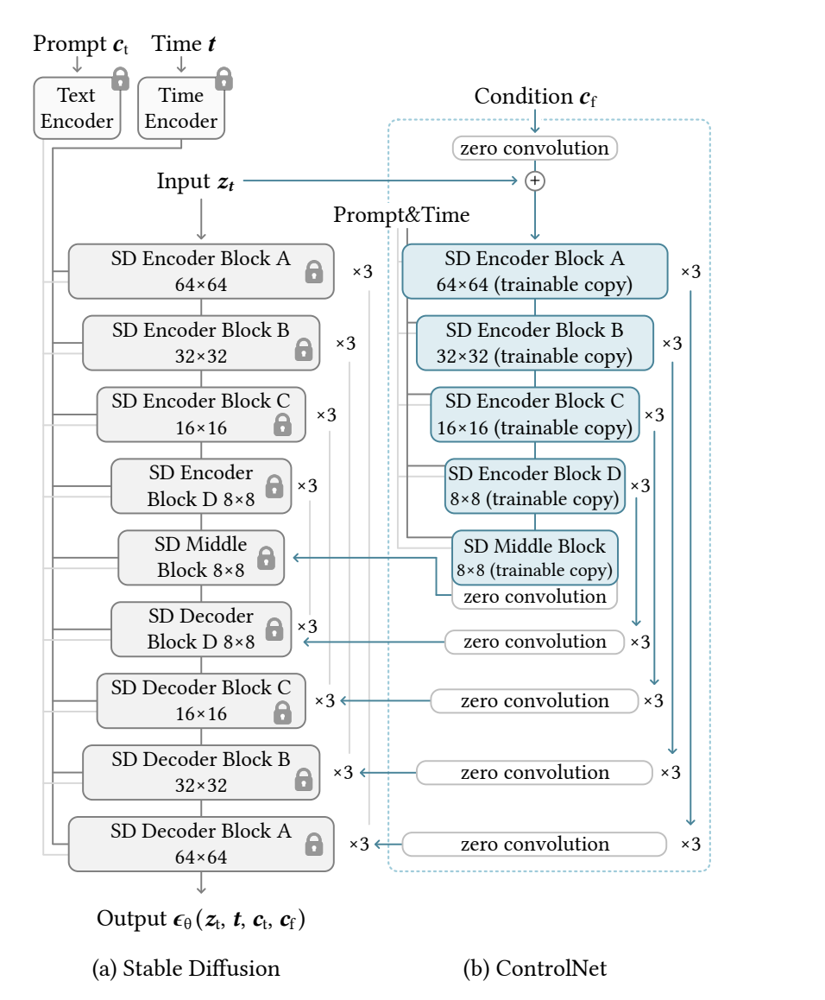

## Stable Diffusion

Image diffusion models learn to progressively denoise
images and generate samples from the training domain. The
denoising process can occur in pixel space or in a latent
space encoded from training data. Stable Diffusion uses
latent images as the training domain as working in this space
has been shown to stabilize the training process [72]. Specifically, Stable Diffusion uses a pre-processing method similar
to VQ-GAN [19] to convert 512 × 512 pixel-space images
into smaller 64 × 64 latent images. 

### Controlled Generation

#### 1. Classifier-Free Guidance (CFG) in Stable Diffusion

**Classifier-Free Guidance (CFG)** is a technique that helps diffusion models like Stable Diffusion improve the quality of generated images by controlling the balance between **unconditional** and **conditional** outputs during the denoising process. This allows the model to generate images that follow the guidance (such as a text prompt) while maintaining some flexibility to avoid overfitting the guidance.

The formula for CFG is as follows:


Where:
- **ε_prd**: The final predicted output used in the denoising process.
- **ε_uc**: The unconditional noise prediction (without any conditioning).
- **ε_c**: The conditional noise prediction (with the text prompt or guidance).
- **β_cfg**: The guidance scale, a user-specified parameter that controls how strongly the model should follow the conditional output.

#### How CFG Works

The basic idea is to combine the **unconditional** output and the **conditional** output using the **guidance scale** (β_cfg). By adjusting this guidance scale, you can control how much influence the text prompt (or other conditioning) has on the generated image.

- **When β_cfg = 0**: The model completely ignores the guidance and uses only the unconditional prediction.
- **When β_cfg = 1**: The model gives equal importance to the unconditional and conditional predictions.
- **When β_cfg > 1**: The model puts more emphasis on the guidance, making the output more strongly aligned with the prompt. However, setting β_cfg too high may lead to artifacts or unrealistic images.

$$\epsilon_{\text{prd}} = \epsilon_{\text{uc}} + \beta_{\text{cfg}} (\epsilon_{\text{c}} - \epsilon_{\text{uc}})$$


In essense

```python
epsilon_uc = np.random.randn(256, 256)  # Unconditional prediction
epsilon_c = np.random.randn(256, 256)   # Conditional prediction (guided by text prompt)

# User-specified guidance scale (CFG weight)
beta_cfg = 7.5  # Typical values range from 5 to 15

# Classifier-Free Guidance calculation
epsilon_prd = epsilon_uc + beta_cfg * (epsilon_c - epsilon_uc)

# Output: epsilon_prd is the final noise prediction used for denoising
```
#### Guidance scale 
Tuning the Guidance Scale
Lower values (e.g., 1-5) produce more generic images.
Higher values (e.g., 7-15) result in stronger adherence to the prompt, but extreme values might distort the output.
A good starting point is to use a β_cfg value between 7 and 10 for typical text-to-image generation tasks.


#### 2. Control Net (Adding Conditional Control to Text-to-Image Diffusion Models)
[Paper](https://arxiv.org/pdf/2302.05543)


<p align="center">
    
</p>

The zero conv with weights initialized to 0 will still learn as long as the input is non zero see explaning her [Zero Conv](https://github.com/lllyasviel/ControlNet?tab=readme-ov-file)

