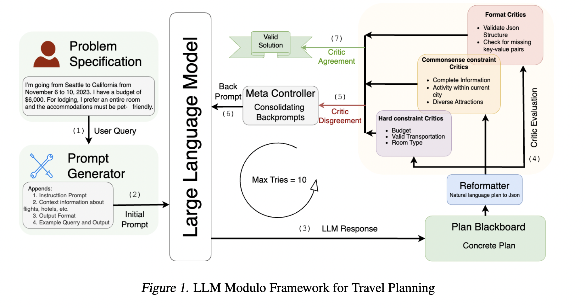

## Can LLMs Plan and Reason?

Most of the ideas below are excellent Subbarao Kambhampati talk at ACL from [Video](https://www.youtube.com/watch?v=0E9BbA0gO1A&t=3087s)

### Key Concepts

1. **Ergodic vs. Non-Ergodic Environments**:
   - **Ergodic Environment**: Transitioning between states is possible with a non-zero probability, meaning there's no risk of being permanently stuck in any one state.
   - **Non-Ergodic Environment**: Planning becomes crucial as errors can lead to high costs or irrecoverable states. Incorrect plans can be very costly.

2. **Plan Robustness**:
   - Defined as the likelihood that a plan will accomplish its goal.
   - In deterministic settings, robustness equates to correctness.
   - To measure robustness, simulators or world models are necessary, but it's unclear how much real-world modeling LLMs can handle.

3. **Plan Quality**:
   - Quality encompasses user preferences and style (e.g., travel plans involving walking, biking, or driving).
   - LLMs are good at capturing style preferences, as style is a property of the data distributions they learn from.
   - Correctness is instance level propoerty. LLMs cannot guantentee it.

4. **LLMs and Decision-Making**:
   - LLMs are trained on next-token prediction, learning statistical distributions over deterministic rules.
   - This makes them adept at stylistic adaptation but unable to ensure correctness, which depends on instance-level properties.
   - Since LLMs address undecidable questions, they operate on fixed time per token, treating both solvable and unsolvable problems alike, without guarantees.

5. **Limits of LLMs**:
   - They cannot guarantee robustness or correctness.
   - They excel in generating ideas and translating problems but aren’t ideal for deterministic or non-deterministic problem solving that requires guarantees.

6. **Practical Use**:
   - LLMs are excellent idea generators, leveraging vast knowledge and adaptability.
   - While not suited for deterministic planning, they’re valuable for idea generations given the ideas be verified by external validator (like python interpreter).

## LLM Agents Survey

“An autonomous agent is a system situated within and a
part of an environment that senses that environment and
acts on it, over time, in pursuit of its own agenda and so
as to effect what it senses in the future.”
**Franklin and Graesser (1997)**

[LLM Agents 2024](https://arxiv.org/pdf/2308.11432) survey and comparison.

## Robust Planning with LLM-Modulo Framework: Case Study in Travel Planning  [Paper](https://arxiv.org/pdf/2405.20625)

#### Summary:

Despite advanced agentic methods like CoTs and React and Reflexion LLMs perform poorly on the long term planning tasks like travel planning.

    

This work provides various uses of LLMs
in the planning pipeline such as idea-generators, translators, problem specification enrichment, critic/model acquisition e.t.c

### Prompt Generator
Prompt Generator Consistent with use of LLMs as agents
we provide an instruction prompt the LLM along with the context information about flights, hotels etc. We also provide instructions on the output format of the generated plan and present few shot example. This is directly inherited from the implementation of [travelbenchmark](https://arxiv.org/pdf/2402.01622)

### Plan Backboard and Reformatter

We  then transform the LLM generated natural language travel plan into a valid JSON
format and store it in the plan blackboard. This translation
is done through the use of LLM as a reformulator and we
reuse it for our model based critics which require structured
parseable plans.

### Crtics
All of the critics that we use are binary critics paired
with a backprompt describing the issue should the critic
detect one. The Format critics ensures the syntactic validity
of the plan such as validating the JSON and eliminating any
missing key-values which is a precondition for all other critics, therefore takes precedence. We repurpose the commonsense constraints as style critics that provide information about missing implicit preference considerations and finally use the hard-constraints as the remainder of the critics.

### Metacontroller
All of the critics evaluate a generated plan
and incase any of the critics find issues with the generated
plan the metacontroller takes on the control flow. In this case metacontroller just outputs the concatenated response of all the criticcs along with original prompt. It is simple yet effecitve method another way is to also pass it through prompt generator with few shot examples and some data context.

### Self Consistency (forward pass)
([Paper](https://openreview.net/pdf?id=1PL1NIMMrw))

The paper introduces self-consistency, a novel decoding strategy that improves the reasoning performance of large language models using chain-of-thought prompting. Instead of relying on greedy decoding, self-consistency samples multiple diverse reasoning paths and selects the most consistent answer.
Here's a breakdown of the self-consistency method:

**Chain-of-Thought Prompting:** The language model is prompted to generate a series of short sentences mimicking a human's reasoning process to solve a task. For example, when asked, "If there are 3 cars in the parking lot and 2 more cars arrive, how many cars are in the parking lot?" the model is prompted to respond with: "There are 3 cars in the parking lot already. 2 more arrive. Now there are 3 + 2 = 5 cars. The answer is 5."

**Diverse Reasoning Paths:** Instead of choosing a single optimal reasoning path (greedy decoding), the model samples multiple diverse reasoning paths. This is based on the idea that complex reasoning problems often have multiple ways of arriving at the correct solution. For instance, in a math question, a model might produce several plausible responses, all reaching the same correct answer.

**Marginalization and Aggregation:** The sampled reasoning paths might lead to different final answers. Self-consistency marginalizes out these reasoning paths and aggregates the final answers, selecting the most consistent answer. This is similar to how humans gain confidence in an answer when multiple different lines of thinking lead to the same conclusion. The most consistent answer is determined by a majority vote among the generated answers.
Here's a code-block that summarizes the self-consistency method, and it would work well in a github readme.

**Benefits:**

*   **Improved Accuracy:** Self-consistency significantly boosts performance on arithmetic and commonsense reasoning tasks .
*   **Unsupervised:** It works with pre-trained language models without extra training or human annotation.
*   **Robust:** It is robust to different sampling strategies and imperfect prompts

*   **Self-Ensemble:** It acts like a "self-ensemble" within a single language model .

### Large Language Models are Better Reasoners with Self-Verification
[Paper](https://arxiv.org/pdf/2212.09561)

Concept: This approach explicitly incorporates a backward verification step to assess the correctness of answers generated through chain-of-thought reasoning.

**Mechanism:**

Forward Reasoning: The LLM generates candidate answers using chain-of-thought prompting, similar to self-consistency.

Backward Verification:

▪
The generated answers are treated as part of the conditions for the original problem.

▪
The model is prompted to re-evaluate the original conditions or other parts of the context based on the proposed answer.

▪
Verification scores are calculated based on the consistency between the predicted values in this backward verification step and the original values, and the answer with the highest score is chosen.

▪
Two types of Backward Verification questions:

1. True-False Item Verification (TFV): A general approach that asks the LLM if all the conditions, including the proposed conclusion, are mutually satisfied.
 
 2. Condition Mask Verification (CMV): Used for arithmetic reasoning, this method masks specific conditions (e.g., numbers) in the original problem and asks the model to predict the masked value.

**Advantages:**

Improved Accuracy: Self-verification improves the reasoning performance on various arithmetic, commonsense, and logical reasoning datasets.

Interpretability: The verification scores offer an interpretable way to assess the model's reliability.

No Additional Training: Like self-consistency, this method does not require additional training or human annotation.

Combinable: It can be combined with other techniques like self-consistency and Program-Aided Language models (PAL) to further improve performance.

Limitations: The effectiveness of self-verification is limited by the accuracy of the candidate answers generated during forward reasoning and may not be suitable for evaluating the LLM's inference procedure.
Key Differences Between Self-Consistency and Self-Verification

Implicit vs. Explicit Verification: Self-consistency uses implicit verification by aggregating diverse reasoning paths and selecting the most consistent answer. Self-verification employs a more explicit backward verification step, where the model re-evaluates conditions in light of its generated answers.

Mechanism: Self-consistency focuses on generating diverse reasoning paths and selecting the most consistent answer. Self-verification focuses on generating candidate answers then verifying them with an additional backward step.

Scope: Self-consistency is broadly applicable to problems with a fixed answer set, while self-verification uses different approaches depending on the type of reasoning, i.e. TFV for general QA tasks, and CMV for arithmetic reasoning.

Interpretability: Self-verification has a clear interpretable score based on the backward verification which enhances the explainability of the prediction.

Computational Cost: Both methods increase computation due to sampling multiple paths but self-consistency may be slightly less computationally expensive since self-verification requires an extra reasoning step.
