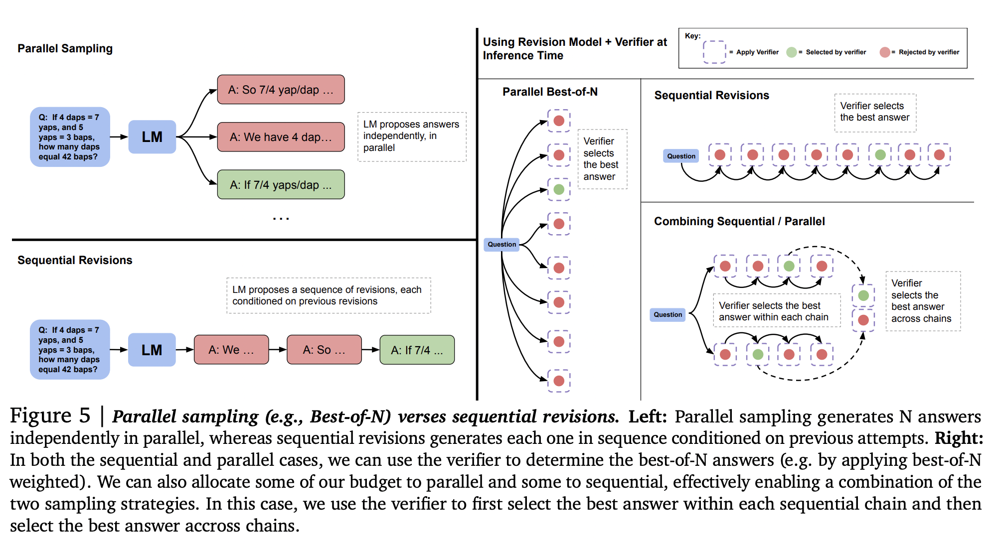

### Problem Statement

We are given a prompt and a test-time compute budget within which to solve the problem. Under
the abstraction above, there are different ways to utilize test-time computation. Each of these
methods may be more or less effective depending on the specific problem given. How can we
determine the most effective way to utilize test-time compute for a given prompt? And how well
would this do against simply utilizing a much bigger pretrained model?

There are two main methods to do it durint test time

### Scaling Test-Time Compute via Verifiers, Search against process reward model (PRM)

Different search methods include:

1. **Best-of-N weighted**

We sample N answers independently from the base LLM and then select the best
answer according to the PRM’s final answer judgement.

2. **Beam search**

Beam search optimizes the PRM by searching over its per-step predictions.. Concretely, we consider a fixed number of beams 𝑁 and a beam width
𝑀. We then run the following steps:
1. sample 𝑁 initial predictions for the first step in the solution
2. score the generated steps according to the PRM’s predicted step-wise reward-to-go estimate (which
also corresponds to the total reward from the prefix since the reward is sparse in this setting)
3. filter for only the top 𝑁
𝑀
highest scoring steps
4. Now from each candidate, sample 𝑀 proposals from the next step, resulting in a total of 𝑁/𝑀 × 𝑀
candidate prefixes again. Then repeat steps 2-4 again

3. **Lookahead search**
Lookahead search modifies how beam search evaluates individual steps. It uses
lookahead rollouts to improve the accuracy of the PRM’s value estimation in each step of the search
process. Specifically, at each step in the beam search, rather than using the PRM score at the current step
to select the top candidates, lookahead search performs a simulation, rolling out up to 𝑘 steps further
while stopping early if the end of solution is reached. To minimize variance in the simulation rollout,
we perform rollouts using temperature 0. The PRM’s prediction at the end of this rollout is then used
to score the current step in the beam search. That is, in other words, we can view beam search as a
special case of lookahead search with 𝑘 = 0.

## Which problem does search improve:

We find that the efficacy of any given verifier search method depends critically on both the compute
budget and the question at hand. Specifically, beam-search is more effective on harder questions
and at lower compute budgets, whereas best-of-N is more effective on easier questions and at higher
budgets. Moreover, by selecting the best search setting for a given question difficulty and test-time
compute budget, we can nearly outperform best-of-N using up to 4x less test-time compute.

### Refining the Proposal Distribution Sequentially

This method enables the model to revise their own answers iteratively, allowing the model to dynamically improve it’s own distribution at test time. Simply prompting existing LLMs to correct their own mistakes tends to be
largely ineffective for obtaining performance improvements on reasoning problems This method incorporate modifications for our setting, and finetune language models to iteratively revise their own answers.

### Sequential Vs Parallel Sampling

We might expect sequential and parallel sampling to have different properties. Sampling answers in
parallel may act as more of a global search process, that could in principle, provide coverage over many
totally different approaches for solving a problem, for instance, different candidates might utilize different
high-level approaches altogether. Sequential sampling, on the other hand, may work more as a local
refinement process, revising responses that are already somewhat on the right track. Due to these
complementary benefits, we should strike a balance between these two extremes by allocating some of
our inference-time budget to parallel sampling (e.g. √
𝑁) and the rest to sequential revisions (e.g. √
𝑁).
We will now show the existence of a compute-optimal ratio between sequential and parallel sampling,
and understand their relative pros and cons based on difficulty of a given prompt.

    

### References:

[DeepMind Scaling LLM Test-Time Compute Optimally can
be More Effective than Scaling Model Parameters](https://arxiv.org/pdf/2408.03314)

[HF BLOG] (https://huggingface.co/spaces/HuggingFaceH4/blogpost-scaling-test-time-compute)
