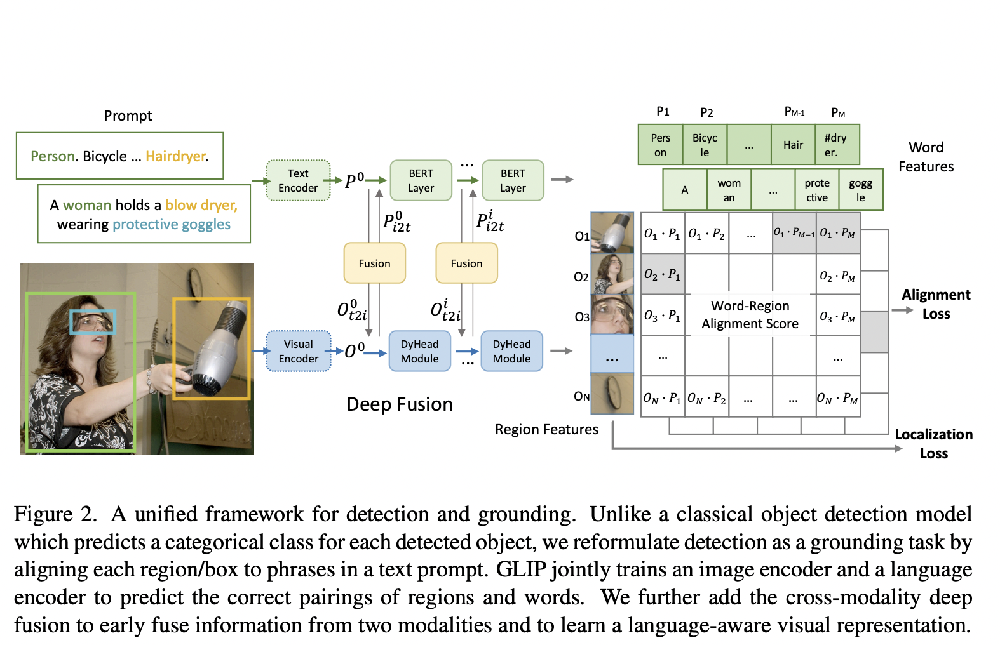

## Grounded Language-Image Pre-training (GLIP) 
[Paper](https://arxiv.org/pdf/2112.03857)|
[Official code](https://github.com/microsoft/GLIP)| 
[Simplified Implementation](https://github.com/microsoft/GLIP)|

## Summary

Phrase grounding is a task of identifying the fine-grained correspondence between phrases in a sentence and objects (or regions) in an image. Idea is to go combine traiditonal object detector and groudning phrases to single framework we can do that by inputing text and images to the framework instead of just images as in traditional object detection, the model aligns image regions with textual phrases in a prompt.

### Traditional Detection Model
- Input image → Visual Encoder (CNN/Transformer) → Region/Box Features
- Two prediction heads:
  - Box classifier (C)
  - Box regressor (R)
- Training losses: $$L = L_{cls} + L_{loc}$$

$L_{loc}$ is usually L1 loss and GIOU loss combined. It is handeled same way as traditional object detection but classification loss is handeled differently. 

The **traditional classification** process:

$$O = Enc_I(Img), S_{cls} = OW^T, L_{cls} = loss(S_{cls}; T)$$

Where:
- $O \in \mathbb{R}^{N \times d}$ : Object/region features
- $W \in \mathbb{R}^{c \times d}$ : Classifier weight matrix
- $S_{cls} \in \mathbb{R}^{N \times c}$ : Classification logits (c is number of classes)
- $T \in \{0,1\}^{N \times c}$ : Target matching matrix

The **detection-as-grounding formulation given by GLIP** is:

$$O = Enc_I(Img), P = Enc_L(Prompt), S_{ground} = OP^T$$

Where:
- $P \in \mathbb{R}^{M \times d}$ : Contextual word/token features
- $S_{ground} \in \mathbb{R}^{N \times M}$ : Region-word alignment scores

$M$ is much larger than $c$ because of multi word phrases (e.g., "traffic light"), sub word tokenization (e.g., "tooth#brush") and special tokens to take care of it do this

Expands $T \in \{0,1\}^{N \times c}$ to $T' \in \{0,1\}^{N \times M}$ and then calculate $loss(S_{cls}; T')$
Makes all sub-words positive match for positive phrases. Set negative match for added tokens

**Text Prompt Design**
   - Simple format: "Detect: person, bicycle, car, ..., toothbrush"
   - BERT-optimized format: "person. bicycle. car. ... . toothbrush"

Finally Use focal binary sigmoid loss for training and averages token probabilities for phrase probability during inference

### Model Architectures

    

### Late vs Deep Fusion
- **Late Fusion**: Image and text encoded separately, fused only at final alignment
- **Deep Fusion**: Introduces cross-modality interaction in final encoding layers

Multimodal deep fusion

$$O^{i}_{t2i}, P^{i}_{i2t} = \text{X-MHA}(O^i, P^i)$$
$$O^{i+1} = \text{DyHeadModule}(O^i + O^{i}_{t2i})$$
$$P^{i+1} = \text{BERTLayer}(P^i + P^{i}_{i2t})$$

Where:
- $$O^0$$ : Initial visual features from vision backbone
- $$P^0$$ : Initial token features from BERT
- $$L$$ : Number of DyHead modules
- Final outputs: $$O = O^L, P = P^L$$

2. **Cross-Modality Multi-Head Attention (X-MHA)**
$$O^{(q)} = OW^{(q,I)}, P^{(q)} = PW^{(q,L)}$$
$$\text{Attn} = O^{(q)}(P^{(q)})^T/\sqrt{d}$$
$$O_{t2i} = \text{SoftMax}(\text{Attn})P^{(v)}W^{(out,I)}$$
$$P_{i2t} = \text{SoftMax}(\text{Attn}^T)O^{(v)}W^{(out,L)}$$

## Key Benefits
1. Enhanced phrase grounding performance
2. Language-aware visual features
3. Single model capability for multiple detection tasks

## Implementation Details
- Uses DyHead as image encoder
- Employs BERT as text encoder
- Adds new BERT layers on top of pre-trained BERT
- Trainable parameters: $$\{W^{(symbol,I)}, W^{(symbol,L)}: symbol \in \{q, v, out\}\}$$

## Technical Notes
- Deep fusion enables conditional predictions based on text prompts
- Cross-modality attention similar to standard Multi-Head Self-Attention
- Model reduces to late-fusion when context vectors are removed

