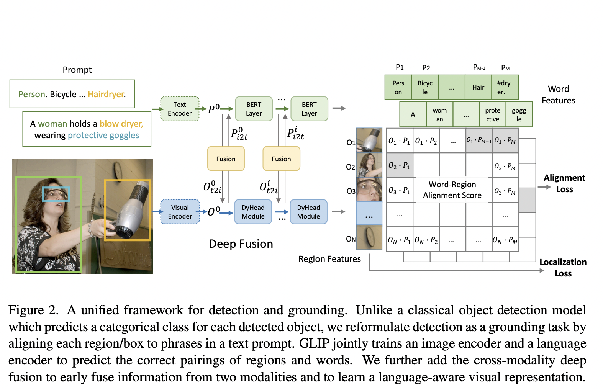

## Grounded Language-Image Pre-training (GLIP) 
[Paper](https://arxiv.org/pdf/2112.03857)
[Official code](https://github.com/microsoft/GLIP)
[Simplified Implementation](https://github.com/microsoft/GLIP)

### Summary

Phrase grounding is a task of identifying the fine-grained correspondence between phrases in a sentence and objects (or regions) in an image.

    

