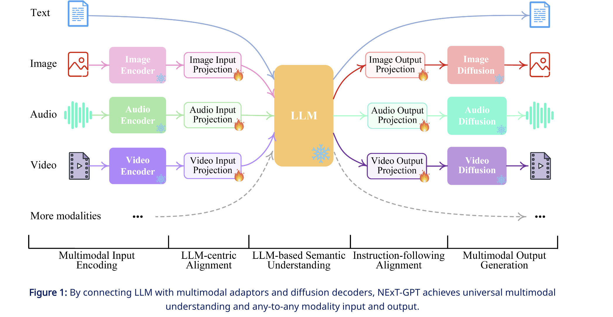
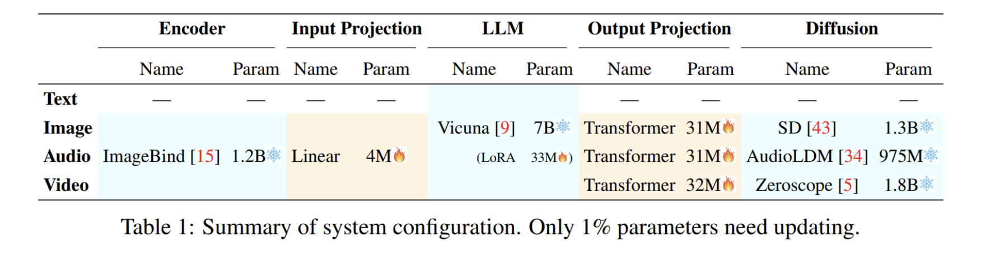
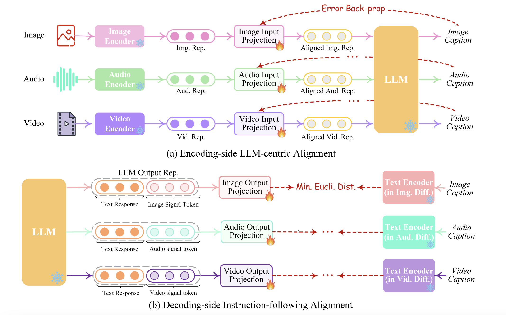
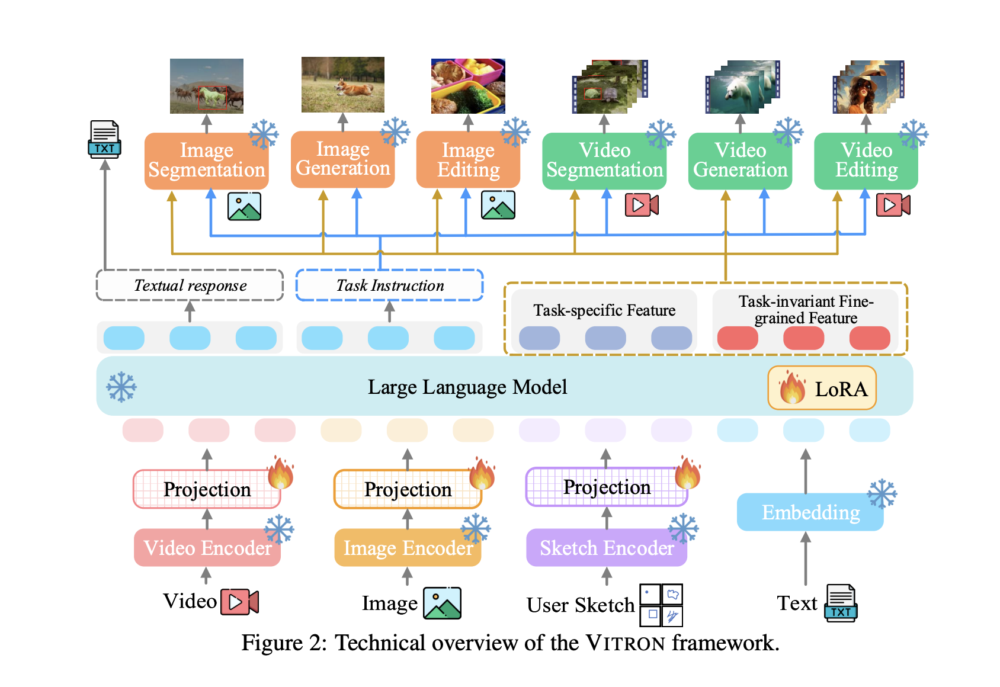

### GLIP

 

## NExT-GPT: Any-to-Any Multimodal LLM

[Code](https://github.com/NExT-GPT/NExT-GPT) | [Paper](https://arxiv.org/pdf/2309.05519)

### Summary:

Multimodal Large Language Models (MM-LLMs) have advanced significantly, they often only understand multimodal inputs without generating multimodal outputs. NExT-GPT addresses this by creating an end-to-end system capable of any-to-any modality interactions (multimodal in outputs and inputs). It connects an LLM with multimodal adaptors and diffusion decoders, allowing it to handle text, images, videos, and audio. Utilizing well-trained encoders and decoders, NExT-GPT requires minimal parameter tuning, making it cost-effective and easily expandable. . This research demonstrates the potential for AI to model universal modalities, advancing human-like AI development.

### Architecture

    

### Encoders
1.  Multimodal Encoding Stage

Leverage existing high-performance models to encode inputs from various modalities. Utilize ImageBind, a unified encoder across six modalities. Map different input representations into language-like representations via a linear projection layer, making them comprehensible to the LLM.

#### ImageBind

ImageBind learns a joint embedding across six different modalities - images, text, audio, depth, thermal, and IMU data. It enables novel emergent applications ‘out-of-the-box’ including cross-modal retrieval, composing modalities with arithmetic, cross-modal detection and generation. [ImageBind Code](https://github.com/facebookresearch/ImageBind)

2.  LLM Understanding and Reasoning Stage

Employ Vicuna as the core agent of NExT-GPT. The LLM takes input representations from different modalities, performing semantic understanding and reasoning. It outputs:
1. Textual responses.
2. Signal tokens for each modality, serving as instructions for the decoding layers to generate multimodal content.

3. Multimodal Generation Stage

Transformer-based output projection layers map signal token representations into forms understandable by multimodal decoders. Use off-the-shelf latent conditioned diffusion models for different modal generations:
- Stable Diffusion (SD) for image synthesis.
- Zeroscope for video synthesis.
- AudioLDM for audio synthesis.

### Project Layers to train for alignement

    

### Alignment

Two kind of aligment
1. Encoding Alignment
2. Decoding aliggment

    

Decoding side alignment is essentiatally we minimize the eucledian distance 

## VITRON: A Unified Pixel-level Vision LLM for Understanding, Generating, Segmenting, Editing

[Code](https://vitron-llm.github.io/) | [Paper](https://haofei.vip/downloads/papers/Skywork_Vitron_2024.pdf)

### Summary:

Vitron tries to address two common gaps with MLLMs (multimodal LLMs):
1. MLLMs are generalist e.g., they have coarse-grain instance-level understanding.
2. Lack of unified support for both images and videos and their coverage for visual understanding and generation.

### Architecture:

VITRON employs a common 'encoder-LLM-decoder' architecture, similar to other popular MLLMs. The framework consists of three main components:

1. **Frontend Vision & Language Encoders**: These encoders process the input images and text.
2. **Central LLM**: This component is responsible for semantic understanding and text generation.
3. **Backend Decoder Modules**: These modules handle user responses and vision manipulation.

    

### Details

### Image and Video Encoder:

For both images and videos, we use the CLIP ViT-L/14@336px model as the encoder. The video encoder processes each frame independently and applies average pooling across the temporal dimension to generate overall temporal representation features.

### Core LLM:

In VITRON, the LLM is Vicuna (7B, version 1.5) to process inputs from both language and visual modalities for semantic understanding and reasoning. The LLM outputs textual responses for visual comprehension tasks and transmits instructions to backend modules for complex tasks like visual segmentation, generation, and editing. VITRON integrate discrete textual instructions and continuous signal embeddings to enhance task performance. The LLM outputs: 
1. Text responses for users.
2. Text instructions for module invocation.
3. Feature embeddings of special tokens, split into task-specific and task-invariant visual-language features.

#### BackEnd Models

To enable our MLLM with various visual task abilities, we integrate several specialized vision models into the LLM. For image generation and editing, we use the diffusion-based model GLIGEN. For image and video segmentation, we employ SEEM. For video generation, ZeroScope and I2VGen-XL are used for text-to-video and image-to-video tasks, respectively. For video editing, we incorporate StableVideo. The LLM's text instructions determine which task module to invoke, while feature embeddings are fed into the corresponding module’s feature encoder to assist with task execution. We design a structured invocation template that includes
1. Module name
2. Invocation command
3. An optional region specifying a fine-grained vision feature needed for certain tasks.

This design aims to achieve feature decoupling, sharing task-invariant fine-grained features among all tasks to facilitate synergy.

### Training

VITRON framework, train the model with three stages of targets. First, it endows model with basic multimodal capabilities, i.e., comprehension and generation. Then, we engage in
fine-grained vision grounding instruction tuning to further enhance the model’s pixel-level perception abilities. Finally, we carry out cross-task synergy learning, maximizing the shared fine-grained features among all tasks.

